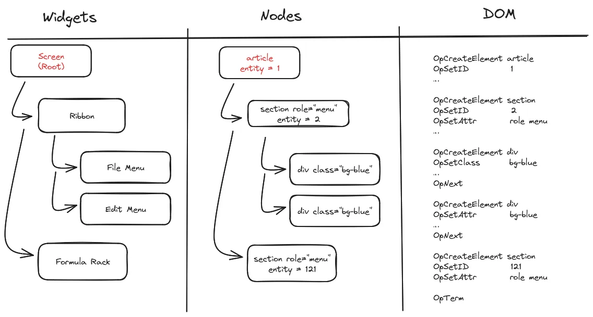

# How the Engine Works

We really find the rx engine is working for us in the background, and usually you should not have to worry about it. But sometimes, it pays off to understand how things work under the hood.

## Trees, Trees Everywhere

The rx engine is following (broadly) a three-steps rendering process, building three successful trees:



### The Widget Tree

UI elements under control of the developer are Widgets, implementing a simple interface:

```go
 type Widget interface{ Build(Context) *Node }

```

This interfaces captures the essence of the reactive programming pattern: the rendering phase is a pure function from state to view. The state is updated later by user intents (see the paragraph on Javascript inter-operation for more details), which triggers a new rendering cycle.

A very simple trick means static functions (also called stateless widgets) with the right signature are all valid widgets:

```go
type WidgetFunc func(Context) *Node

func (f WidgetFunc) Build(ctx Context) *Node { return f(ctx) }

```

As an example, a simple menu widget (in this case to collect an allocation profile) can look like:

```go
func debugmenu() *Node {
	return Get(`<div class="z-10 center-float border bg-white flex flex-col absolute flex-auto w-32 h-60">`).AddChildren(
		Get(`<button type="button">Allocations Profile</button>`).OnIntent(Click, RequestPProf),
	)
}

```

Many other types instead need to retain state between rendering loops, and are expressed as plain Go structs, and the Build method feel a nice blend of plain old Go code and reactive patterns:

```go
type Ribbon struct {
	expandedmenu int
	animate      bool
}

func (r *Ribbon) Build(ctx rx.Context) *rx.Node {
	w := Get(`<div class="absolute top-0 left-0 flex bg-white …">`)
	if r.animate {
		w.AddClasses("animate-fade-out")
	}
}

```

As a user of the library, that’s pretty much all you need to know to use it.

But keep reading to learn more about the rest of the rendering pipeline, and get a feel for the tradeoffs making the engine tick.

### The Node Tree

The node tree is a fairly direct representation, in the Go side, of the HTML DOM tree (the end result): node tag names, classes, attributes and text are exactly what you expect them to be.

The node tree API follows a simple chaining API, and creating elements can be done by filling all properties one by one:

```go
preview := rx.Node{TagName: "p"}
preview.AddClass("bg-zinc-200").SetText("hello world")

```

This paradigm is sufficient, and can even be convenient when building conditional trees, but it is much more verbose than the HTML equivalent,especially when the number of classes, or nested elements increases to build a specific widget.
The library exposes a `Get` function to solve exactly this case, allowing us to use to program by using direct HTML snippets. Of course, the two API are compatible, so you don’t lose any expressive power of choosing the  concise form.

```go
preview := Get(`<p class="bg-zinc-200">hello word</p>`)
if important {
	preview.AddClass("text-orange-700")
}

```

Behind the scene, `Get` implementation uses a few cute little tricks: the input is parsed using an HTML tokenizer, and the nodes are constructed using the chaining API. A string cache make sure that constant strings (the most common case) do not need to be re-parsed more than once.

Nodes allocation is also carefully calibrated: Go’s garbage collector is trading latency for bandwidth, and creating all nodes on each rendering tick is wasteful. Instead, nodes are allocated from an arena, and freed all at once when the rendering is over by setting the stack pointer to zero – a trick sometimes called “secondary allocators”.

Nodes have an entity number (equivalent to the key in React parlance) to track identity across rendering: while we live (and program) comfortably in our reactive, state-directed world, the DOM API clearly are inherited from a time where stateful modification of the tree view was the norm; not only can this be less efficient to re-render complex trees, effects such as drag-and-drop (a key UX component!) break if you re-render the view instead of move things around!

And rendering is indeed what the last tree is about, so hop on to the next paragraph to continue the exploration.

### The DOM Tree

Creating the DOM tree from the Node tree is pretty much a one-to-one mapping; but a few details are worth consideration.

First, not all elements have a direct translation in HTML: for example, the library offers a “nothing” element which maps to, you guessed it, nothing in the final DOM tree. This is particularly useful when UI elements should only be conditionaly displayed (say a menu is only visible if the corresponding button is selected). Using a dedicated element for those cases make the code flow much more naturally:

```go
func ToolMenu() *rx.Node {
	menu := Nothing()
	if menuopen {
		menu = Get(`<div class="bg-zinc-100">`)
	}
	return menu
}

```

Second, elements that need be preserved across rendering cycles are given the specific “reuse” tag name: rendering move the existing DOM element into the new tree, instead of creating an element anew. This works by remembering which Entity was created during the last cycle, and asking nicely that it gets reused during the next phase.

Third, entity numbers are attributed to all elements of interest: nodes that will need to get reused, or nodes accepting user’s intents. As the entity numbers are unique (and are mapped to DOM’s element “id”), a simple counter could be, at first glance, a perfectly reasonable solution; but we need to address entities created during the last rendering phase for reuse; and a simple counter could create duplicates! The (also simple) solution is to notice that we only need to remember two trees: the current one being built, and the one before it. The engine flips between allocating increasing even and odd numbers to nodes in the current render tree – so there is no conflict possible.

The rendering leaves a artefact that persists after the rendering phase is terminated: a simple tree of handlers, ready to react to the user’s intents and start the loop again.
This means it is now time to cross the border, and see how Go and Javascript work in harmony (mostly).

## Interoperating with Javascript

In the previous part, I somewhat hand-waved how the DOM tree is created from the Node tree.

But a naive implementation would probably not match our performance budget: while tremendous work is happening to make calling WASM from Javascript efficient, there is always a cost to bridge
the two worlds (if anything since it completely prevents compiler optimisation such as inlining or loop unrolling). The engine instead serializes the tree to a simple virtual machine, written to a shared buffer (`Uint8Array` in the JS world), which the Javascript codes executes on a hidden node (a `DocumentFragment`) until the full tree is built, and finally swaps the old and the new tree.

If this sounds familiar to anyone with experience in UI programming, that’s because this is exactly how [compositing with double buffering works in the CPU/GPU world](https://www.chromium.org/developers/design-documents/gpu-accelerated-compositing-in-chrome/) – imitation is indeed the sincerest form of flattery!

On top of the new UI tree, the Go code can return a few (4 as of now) arbitrary values to Javascript – this can be used, for example, to pass content to the clipboard, or a file handler (`ReadableStream` in the JS world) to download a large amount of data. The implementation relies on passing a continuation to the Go code, which gets called when the rendering cycle is terminated. On the Javascript side, this maps very neatly with the `Promise` paradigm, leading to natural-looking Javascript code (`updateGo` will be discussed in the next paragraph):

```jsx
const [act, name, buffer, _] = await new Promise<FourArgs>(
      (done) =>
          this.updateGo(intent, target, { point, done }),
);
// do something with the first 3 registers mapped to act, name and buffer.

```

We now have a pretty solid understanding of how the view gets updated from the initial state, but did not yet address how user interactions with the widget can update the state (and having static views would very much defeat the purpose of the engine!).

By design, the engine does not drive the rendering at a given frequency – say 60fps, but instead stays quiet until the browser wakes it up. Doing so means the resulting widget interacts naturally with the rest of the page (which can contain other elements, not even written in Go), and that we don’t need to hog resources until the user actually wants something from us.

The Javascript pendant of the WASM module is a Web Component (subclass of the HTMLElement), registering `eventHandlers` in the DOM (usually one handler per intent type such as “Click” or “KeyPress”). When the handler is fired, the element can collect important information
from the view (mouse position, current size of the widget, geometric distance to the closest entity, …) into a shared structure called the Javascript `World`. The Go code is then called with `updateGo` method, and given the intent of the user, the first entity under consideration, and the Javascript world. On the Go side, the entity tree built during the DOM tree generation is walked bottom-up until we find a handler for the given intent; this handler is fired, the state updated, and a new rendering cycle can commence.

👉 PS: we’re hiring! If you are interested in software engineering, QA, head to [our website](https://www.trout.software/company) to know more.
